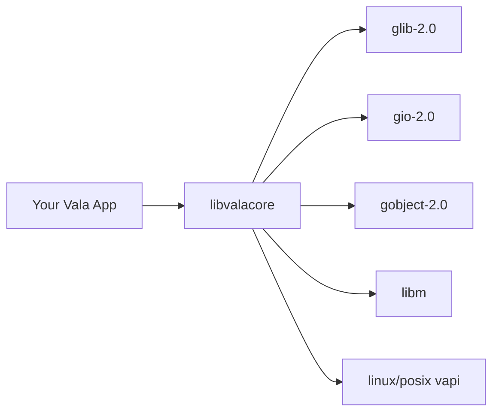

[](https://github.com/nao1215/libvalacore/actions/workflows/coverage.yml)
[](https://github.com/nao1215/libvalacore/actions/workflows/lint.yml)
[](https://github.com/nao1215/libvalacore/actions/workflows/format.yml)


libvalacore is a utility library for day-to-day Vala development.
It adds practical APIs for file I/O, collections, encoding, networking, concurrency, and testing support.

>[!NOTE]
> Until v1.0.0, breaking changes may be introduced between minor versions.

## Dependencies

libvalacore keeps dependencies small and stays on standard Vala/GLib components.

| Dependency | Used for |
|---|---|
| `glib-2.0` | Core types, utilities, test framework |
| `gio-2.0` | Files, streams, sockets, network I/O |
| `gobject-2.0` | Object model and type system |
| `libm` | Math functions |
| `linux.vapi` / `posix.vapi` | OS and POSIX features where needed |



## API Reference

### Valadoc
[Click here for libvalacore Valadoc.](https://nao1215.github.io/libvalacore/)

### Start From Your Use Case

| What you want to do | Start here |
|---|---|
| Read/write/copy files | [Vala.Io.Files](#valaiofiles), [Vala.Io.Path](#valaiopath), [Vala.Io.FileTree](#valaiofiletree) |
| Watch filesystem changes | [Vala.Io.Watcher](#valaiowatcher) |
| Build HTTP clients | [Vala.Net.Http](#valanethttp), [Vala.Net.Retry](#valanetretry), [Vala.Net.CircuitBreaker](#valanetcircuitbreaker) |
| Parse/serialize data formats | [Vala.Encoding.Json](#valaencodingjson), [Vala.Encoding.Yaml](#valaencodingyaml), [Vala.Encoding.Toml](#valaencodingtoml), [Vala.Encoding.Xml](#valaencodingxml) |
| Run concurrent tasks | [Vala.Concurrent.Channel\<T\>](#valaconcurrentchannelt), [Vala.Concurrent.Future\<T\>](#valaconcurrentfuturet), [Vala.Concurrent.ThreadPool](#valaconcurrentthreadpool) |
| Work with collections | [Vala.Collections.ArrayList\<T\>](#valacollectionsarraylistt), [Vala.Collections.HashMap\<K,V\>](#valacollectionshashmapkv), [Vala.Collections.Stream\<T\>](#valacollectionsstreamt) |
| Validate inputs/config | [Vala.Validation.Validator](#valavalidationvalidator) |
| Build CLI tools | [Vala.Parser.ArgParser](#valaparserargparser) |

### API Layout

Use this order if you are new to the library:
1. `Vala.Io` and `Vala.Collections`
2. `Vala.Encoding` and `Vala.Net`
3. `Vala.Concurrent`
4. domain-specific modules (`Vala.Crypto`, `Vala.Time`, `Vala.Math`, etc.)

The detailed API list below is exhaustive. For method-level examples, check Valadoc first.


### Vala.Io.Files
File and directory operations. All methods are static and take a `Vala.Io.Path` argument.

| Method | Description |
|---|---|
| `isFile(Path path)` | Returns whether the path is a regular file |
| `isDir(Path path)` | Returns whether the path is a directory |
| `exists(Path path)` | Returns whether the file or directory exists |
| `canRead(Path path)` | Returns whether the path is readable |
| `canWrite(Path path)` | Returns whether the path is writable |
| `canExec(Path path)` | Returns whether the path is executable |
| `isSymbolicFile(Path path)` | Returns whether the path is a symbolic link |
| `isHiddenFile(Path path)` | Returns whether the path is a hidden file (starts with `.`) |
| `makeDirs(Path path)` | Creates a directory including parent directories |
| `makeDir(Path path)` | Creates a single directory |
| `copy(Path src, Path dst)` | Copies a file from source to destination |
| `move(Path src, Path dst)` | Moves (renames) a file |
| `remove(Path path)` | Deletes a file or empty directory |
| `readAllText(Path path)` | Reads the entire file as a string |
| `readAllLines(Path path)` | Reads the file as a list of lines |
| `writeText(Path path, string text)` | Writes a string to a file |
| `appendText(Path path, string text)` | Appends a string to a file |
| `size(Path path)` | Returns the file size in bytes |
| `listDir(Path path)` | Lists directory entries |
| `tempFile(string prefix, string suffix)` | Creates a temporary file |
| `tempDir(string prefix)` | Creates a temporary directory |
| `touch(Path path)` | Creates a file or updates its modification time |
| `readBytes(Path path)` | Reads file contents as a byte array |
| `writeBytes(Path path, uint8[] data)` | Writes a byte array to a file |
| `chmod(Path path, int mode)` | Changes file permissions |
| `chown(Path path, int uid, int gid)` | Changes file ownership |
| `lastModified(Path path)` | Returns the last modification time |
| `createSymlink(Path target, Path link)` | Creates a symbolic link |
| `readSymlink(Path path)` | Reads the target of a symbolic link |
| `isSameFile(Path a, Path b)` | Returns whether two paths refer to the same file |
| `glob(Path dir, string pattern)` | Returns files matching a glob pattern |
| `deleteRecursive(Path path)` | Recursively deletes a directory and all its contents |

### Vala.Io.Filesystem
Filesystem metadata utility methods.

| Method | Description |
|---|---|
| `getFileAttributes(Path path)` | Returns file attributes (`GLib.FileInfo`) or `null` |
| `setLastModifiedTime(Path path, DateTime t)` | Sets file modification time |
| `isReadable(Path path)` | Returns whether file is readable |
| `isWritable(Path path)` | Returns whether file is writable |
| `isExecutable(Path path)` | Returns whether file is executable |
| `getOwner(Path path)` | Returns owner username or `null` |
| `setOwner(Path path, string owner)` | Sets owner by username (`true` on success) |

### Vala.Io.FileTree
High-level recursive tree operations for traversal, search, copy/sync, and aggregation.

| Method | Description |
|---|---|
| `walk(Path root)` | Recursively walks all files under root |
| `walkWithDepth(Path root, int maxDepth)` | Recursively walks files with depth limit |
| `find(Path root, string glob)` | Finds files by glob pattern |
| `findByRegex(Path root, string pattern)` | Finds files by regex pattern |
| `findBySize(Path root, int64 minBytes, int64 maxBytes)` | Finds files in size range (inclusive) |
| `findModifiedAfter(Path root, DateTime after)` | Finds files newer than given timestamp |
| `copyTree(Path src, Path dst)` | Recursively copies source tree to destination |
| `copyTreeWithFilter(Path src, Path dst, PredicateFunc<Path> filter)` | Recursively copies source tree with filter |
| `sync(Path src, Path dst)` | One-way sync based on file size and modification time |
| `deleteTree(Path root)` | Recursively deletes source tree |
| `totalSize(Path root)` | Returns total byte size of regular files |
| `countFiles(Path root)` | Returns number of regular files |
| `flatten(Path src, Path dst)` | Flattens nested files into destination directory |

### Vala.Io.Watcher
Filesystem watch API with callback-based events, recursive watch support, glob filtering, and debounce.

| Method | Description |
|---|---|
| `watch(Path path)` | Starts watching a file or directory |
| `watchRecursive(Path root)` | Starts recursive directory watch |
| `watchGlob(Path root, string glob)` | Starts recursive watch filtered by glob |

#### Vala.Io.FileWatcher

| Method | Description |
|---|---|
| `onCreated(WatchCallback fn)` | Registers callback for create events |
| `onModified(WatchCallback fn)` | Registers callback for modify events |
| `onDeleted(WatchCallback fn)` | Registers callback for delete events |
| `onRenamed(RenameCallback fn)` | Registers callback for rename events |
| `debounce(Duration interval)` | Sets debounce interval (default: 100ms) |
| `close()` | Stops watch and releases resources |

#### Vala.Io.WatchEvent

| Field | Description |
|---|---|
| `path` | Changed file path |
| `eventType` | Event type (`CREATED`, `MODIFIED`, `DELETED`, `RENAMED`) |
| `timestamp` | UNIX timestamp in milliseconds |

### Vala.Io.AtomicFile
Atomic update helper for safe file replacement with optional backup.

| Method | Description |
|---|---|
| `AtomicFile()` | Creates an atomic writer with default settings |
| `withBackup(bool enabled)` | Enables/disables backup creation before replacement |
| `backupSuffix(string suffix)` | Sets backup suffix (default: `.bak`) |
| `write(Path path, string text)` | Atomically replaces file with text content |
| `writeBytes(Path path, uint8[] data)` | Atomically replaces file with binary content |
| `append(Path path, string text)` | Appends by reading current content then atomically replacing |
| `replace(Path srcTmp, Path dst)` | Replaces destination file with source temp file |
| `readConsistent(Path path)` | Reads text twice and returns `null` if contents changed between reads |

### Vala.Io.FileLock
Lock-file based process coordination utility.

| Method | Description |
|---|---|
| `FileLock(Path path)` | Creates a lock bound to the given lock-file path |
| `acquire()` | Blocks until lock is acquired |
| `acquireTimeout(Duration timeout)` | Tries to acquire lock within timeout |
| `tryAcquire()` | Attempts lock acquisition without blocking |
| `release()` | Releases the lock (removes lock file) |
| `isHeld()` | Returns whether this instance currently holds the lock |
| `withLock(WithFileLockFunc fn)` | Runs callback while holding lock |
| `ownerPid()` | Returns PID written in lock file (`null` when unavailable) |

### Vala.Io.Console
Console utility methods.

| Method | Description |
|---|---|
| `isTTY()` | Returns whether standard input is a terminal |
| `readPassword()` | Reads a password from terminal input without echo (`null` when stdin is not a TTY) |

### Vala.Io.Process
Process execution helper methods.

| Method | Description |
|---|---|
| `exec(string cmd, string[] args)` | Executes an external command and returns true on zero exit status |
| `execWithOutput(string cmd, string[] args)` | Executes an external command and returns stdout text on success (`null` on failure) |
| `kill(int pid)` | Sends SIGKILL to the specified process ID (`true` when signal delivery succeeds). POSIX only |

### Vala.Io.Shell
Shell command utility with captured output and pipeline helpers.

| Method | Description |
|---|---|
| `exec(string command)` | Executes shell command and returns `ShellResult` |
| `execQuiet(string command)` | Executes command and returns result with output fields cleared |
| `execWithTimeout(string command, Duration timeout)` | Executes command through `timeout` with upper time bound |
| `pipe(string[] commands)` | Executes commands as a pipeline (`cmd1 \| cmd2 \| ...`) |
| `which(string binary)` | Resolves command path from `PATH` (`null` if not found) |

#### Vala.Io.ShellResult

| Method | Description |
|---|---|
| `exitCode()` | Process exit code |
| `stdout()` | Captured standard output |
| `stderr()` | Captured standard error |
| `isSuccess()` | `true` when `exitCode() == 0` |
| `stdoutLines()` | Non-empty stdout lines |
| `stderrLines()` | Non-empty stderr lines |
| `durationMillis()` | Execution duration in milliseconds |

### Vala.Io.Temp
Temporary resource helpers that auto-clean up after callback execution.

| Method | Description |
|---|---|
| `withTempFile(TempFunc func)` | Creates a temporary file, runs callback, and removes the file (`true` on success) |
| `withTempDir(TempFunc func)` | Creates a temporary directory, runs callback, and removes the directory recursively (`true` on success) |

### Vala.Io.Path
An immutable value object representing a file system path. Methods that transform the path return a new Path instance.

| Method | Description |
|---|---|
| `Path(string path)` | Constructor. Creates a Path from a string |
| `toString()` | Returns the path as a string |
| `basename()` | Extracts the base name (file name) from the path |
| `dirname(string path)` | Extracts the directory name from the path |
| `extension()` | Returns the file extension including the dot (e.g. ".txt") |
| `withoutExtension()` | Returns the path without the file extension |
| `isAbsolute()` | Returns whether the path is absolute |
| `parent()` | Returns a new Path for the parent directory |
| `resolve(string other)` | Resolves a path against this path |
| `join(string part1, ...)` | Joins multiple path components |
| `equals(Path other)` | Returns whether two paths are equal |
| `startsWith(string prefix)` | Returns whether the path starts with the prefix |
| `endsWith(string suffix)` | Returns whether the path ends with the suffix |
| `components()` | Returns the path components as a list |
| `normalize()` | Returns a normalized path (resolves "." and "..") |
| `abs()` | Returns the absolute, normalized path |
| `separator()` | Returns the OS path separator (static) |
| `volumeName()` | Returns the volume name (empty on Linux) |
| `toUri()` | Returns the file:// URI representation |
| `match(string pattern)` | Returns whether the basename matches a glob pattern |
| `relativeTo(Path base)` | Computes the relative path from a base path |

### Vala.Io.Resource
Resource loading utilities.

| Method | Description |
|---|---|
| `readResource(string name)` | Reads resource bytes from a file path (`null` on failure) |

### Vala.Io.Scanner
Tokenized input reader inspired by Java's Scanner and Go's bufio.Scanner. Reads from files, strings, or stdin and splits input by a configurable delimiter.

| Method | Description |
|---|---|
| `Scanner.fromFile(Path path)` | Creates a Scanner from a file (returns null on error) |
| `Scanner.fromString(string s)` | Creates a Scanner from a string |
| `Scanner.fromStdin()` | Creates a Scanner from standard input |
| `nextLine()` | Reads the next line |
| `nextInt()` | Reads the next token as an integer |
| `nextDouble()` | Reads the next token as a double |
| `next()` | Reads the next token (split by delimiter) |
| `hasNextLine()` | Returns whether there is another line |
| `hasNextInt()` | Returns whether the next token is an integer |
| `setDelimiter(string pattern)` | Sets the delimiter regex pattern |
| `close()` | Closes the underlying stream |

### Vala.Io.StringBuilder
A mutable string buffer for efficient string construction. Wraps GLib.StringBuilder with a rich, Java/C#-inspired API.

| Method | Description |
|---|---|
| `StringBuilder()` | Creates an empty StringBuilder |
| `StringBuilder.withString(string s)` | Creates a StringBuilder with initial content |
| `StringBuilder.sized(size_t size)` | Creates a StringBuilder with pre-allocated capacity |
| `append(string s)` | Appends a string |
| `appendLine(string s)` | Appends a string followed by a newline |
| `appendChar(char c)` | Appends a single character |
| `insert(int offset, string s)` | Inserts a string at the specified position |
| `deleteRange(int start, int end)` | Deletes characters in [start, end) |
| `replaceRange(int start, int end, string s)` | Replaces characters in [start, end) |
| `reverse()` | Reverses the contents |
| `length()` | Returns the current byte length |
| `charAt(int index)` | Returns the character at the index |
| `clear()` | Clears the buffer |
| `toString()` | Returns the built string |
| `capacity()` | Returns the allocated buffer capacity |

### Vala.Io.BufferedWriter
Buffered character-output-stream writer. Wraps GLib.DataOutputStream for convenient string and line writing, similar to Java's BufferedWriter.

| Method | Description |
|---|---|
| `BufferedWriter.fromFile(Path path)` | Creates a writer to a file (replaces content) |
| `BufferedWriter.fromFileAppend(Path path)` | Creates a writer that appends to a file |
| `write(string s)` | Writes a string to the stream |
| `writeLine(string s)` | Writes a string followed by a newline |
| `newLine()` | Writes a newline |
| `flush()` | Flushes any buffered data |
| `close()` | Closes the underlying stream |

### Vala.Io.BufferedReader
Buffered character-input-stream reader. Wraps GLib.DataInputStream for convenient line-by-line or full-text reading, similar to Java's BufferedReader.

| Method | Description |
|---|---|
| `BufferedReader.fromFile(Path path)` | Creates a reader from a file (returns null on error) |
| `BufferedReader.fromString(string s)` | Creates a reader from a string |
| `readLine()` | Reads a single line (null at EOF) |
| `readChar()` | Reads a single byte as a character |
| `readAll()` | Reads the remaining stream as a string |
| `hasNext()` | Returns whether there is more data to read |
| `close()` | Closes the underlying stream |

### Vala.Io.StringJoiner
Constructs a sequence of characters separated by a delimiter, optionally with a prefix and suffix. Equivalent to Java's StringJoiner.

| Method | Description |
|---|---|
| `StringJoiner(string delimiter, string prefix, string suffix)` | Constructor. Creates a StringJoiner with delimiter, prefix, and suffix |
| `add(string element)` | Adds an element to the joiner |
| `merge(StringJoiner other)` | Merges another joiner's elements into this one |
| `setEmptyValue(string value)` | Sets the value returned when no elements are present |
| `length()` | Returns the length of the joined string |
| `toString()` | Returns the joined string with prefix, elements, and suffix |

### Vala.Io.Strings
Static utility methods for string manipulation. All methods are null-safe.

| Method | Description |
|---|---|
| `isNullOrEmpty(string? str)` | Returns whether the string is null or empty |
| `isBlank(string? s)` | Returns whether the string is null, empty, or whitespace only |
| `isNumeric(string? s)` | Returns whether the string contains only digits |
| `isAlpha(string? s)` | Returns whether the string contains only alphabetic characters |
| `isAlphaNumeric(string? s)` | Returns whether the string contains only alphanumeric characters |
| `trimSpace(string str)` | Removes leading and trailing whitespace/tabs |
| `trimLeft(string? s, string cutset)` | Removes specified characters from the left |
| `trimRight(string? s, string cutset)` | Removes specified characters from the right |
| `trimPrefix(string? s, string prefix)` | Removes the prefix if present |
| `trimSuffix(string? s, string suffix)` | Removes the suffix if present |
| `contains(string? s, string? substr)` | Returns whether `s` contains `substr` |
| `startsWith(string? s, string? prefix)` | Returns whether `s` starts with `prefix` |
| `endsWith(string? s, string? suffix)` | Returns whether `s` ends with `suffix` |
| `toUpperCase(string? s)` | Converts to upper case |
| `toLowerCase(string? s)` | Converts to lower case |
| `replace(string? s, string old, string new)` | Replaces all occurrences |
| `repeat(string? s, int count)` | Repeats the string `count` times |
| `reverse(string? s)` | Reverses the string |
| `padLeft(string? s, int len, char pad)` | Pads on the left to specified length |
| `padRight(string? s, int len, char pad)` | Pads on the right to specified length |
| `center(string? s, int width, char pad)` | Centers within specified width |
| `indexOf(string? s, string? substr)` | Returns index of first occurrence (-1 if not found) |
| `lastIndexOf(string? s, string? substr)` | Returns index of last occurrence (-1 if not found) |
| `count(string? s, string? substr)` | Counts non-overlapping occurrences |
| `join(string separator, string[] parts)` | Joins array with separator |
| `split(string? s, string delimiter)` | Splits by delimiter |
| `splitByNum(string str, uint num)` | Splits every `num` characters |
| `substring(string? s, int start, int end)` | Returns substring [start, end) |
| `capitalize(string? s)` | Capitalizes the first character |
| `toCamelCase(string? s)` | Converts to camelCase |
| `toSnakeCase(string? s)` | Converts to snake_case |
| `toKebabCase(string? s)` | Converts to kebab-case |
| `toPascalCase(string? s)` | Converts to PascalCase |
| `title(string? s)` | Capitalizes the first letter of each word |
| `compareTo(string? a, string? b)` | Lexicographic comparison |
| `compareIgnoreCase(string? a, string? b)` | Case-insensitive comparison |
| `equalsIgnoreCase(string? a, string? b)` | Case-insensitive equality |
| `lines(string? s)` | Splits by newlines |
| `words(string? s)` | Splits by whitespace (non-empty tokens) |
| `truncate(string? s, int maxLen, string ellipsis)` | Truncates with ellipsis |
| `wrap(string? s, int width)` | Wraps at specified width |

### Vala.Text.Template
Simple template engine with Mustache/Handlebars-style syntax.

**Template** — Static utility for one-shot rendering.

| Method | Description |
|---|---|
| `render(string template, HashMap vars)` | Renders template with variable substitution |
| `renderFile(Path templatePath, HashMap vars)` | Reads template from file and renders |
| `renderJson(string template, JsonValue vars)` | Renders using JSON object as variables |
| `compile(string template)` | Pre-compiles template for repeated rendering |

**CompiledTemplate** — Pre-compiled template for reuse.

| Method | Description |
|---|---|
| `render(HashMap vars)` | Renders with variable map |
| `renderJson(JsonValue vars)` | Renders with JSON variables |

Template syntax: `{{name}}` (variable), `{{#if flag}}...{{else}}...{{/if}}` (conditional), `{{#each items}}{{.}}{{/each}}` (loop), `{{name | upper}}` (filter: upper, lower, trim, escape), `{{fallback name "default"}}` (fallback value).

### Vala.Text.Regex
Static utility methods for regular expressions.

| Method | Description |
|---|---|
| `matches(string s, string pattern)` | Returns true when the pattern matches |
| `replaceAll(string s, string pattern, string repl)` | Replaces all matches |
| `split(string s, string pattern)` | Splits text by regex pattern |

### Vala.Regex.Pattern
Compiled regular expression wrapper for repeated matching and replacements.

| Method | Description |
|---|---|
| `compile(string pattern)` | Compiles a regex pattern (`null` on invalid pattern) |
| `matches(string input)` | Returns true when the entire input matches |
| `find(string input)` | Returns true when any match exists |
| `findAll(string input)` | Returns all matched substrings |
| `replaceFirst(string input, string replacement)` | Replaces the first match |
| `replaceAll(string input, string replacement)` | Replaces all matches |
| `split(string input)` | Splits input by the pattern |
| `groups(string input)` | Returns capture groups from the first match |

### Vala.Time.DateTime
Immutable value object for date-time operations.

| Method | Description |
|---|---|
| `now()` | Returns current local date-time |
| `of(int year, int month, int day, int hour, int min, int sec)` | Creates date-time from components |
| `parse(string s, string format)` | Parses text using `%Y-%m-%d %H:%M:%S` or `%Y-%m-%dT%H:%M:%S` (returns `null` for unsupported formats) |
| `format(string format)` | Formats with strftime format |
| `year()` / `month()` / `day()` | Returns date components |
| `hour()` / `minute()` / `second()` | Returns time components |
| `dayOfWeek()` | Returns day of week (`1`=Mon, `7`=Sun) |
| `plusDays(int days)` | Returns shifted date-time by days |
| `plusHours(int hours)` | Returns shifted date-time by hours |
| `minusDays(int days)` | Returns shifted date-time by negative days |
| `isBefore(DateTime other)` | Returns whether this is before other |
| `isAfter(DateTime other)` | Returns whether this is after other |
| `toUnixTimestamp()` | Returns UNIX timestamp |
| `fromUnixTimestamp(int64 ts)` | Creates date-time from UNIX timestamp |
| `diff(DateTime other)` | Returns difference as `Duration` |

Examples: `DateTime.parse ("2026-02-28 10:30:00", "%Y-%m-%d %H:%M:%S")`, `DateTime.parse ("2026-02-28T10:30:00", "%Y-%m-%dT%H:%M:%S")`.

### Vala.Time.Dates
Static date-time helper methods.

| Method | Description |
|---|---|
| `now()` | Returns current local date-time |
| `parse(string s, string fmt)` | Parses text into `DateTime` (`null` on failure) |
| `format(DateTime t, string fmt)` | Formats a `DateTime` with strftime format |
| `addDays(DateTime t, int days)` | Returns a new `DateTime` shifted by days |
| `isLeapYear(int year)` | Returns whether the year is leap year |

### Vala.Time.Duration
Immutable value object that represents a duration.

| Method | Description |
|---|---|
| `ofSeconds(int64 secs)` | Creates duration from seconds |
| `ofMinutes(int64 mins)` | Creates duration from minutes |
| `ofHours(int64 hours)` | Creates duration from hours |
| `ofDays(int64 days)` | Creates duration from days |
| `toSeconds()` | Returns duration in seconds |
| `toMillis()` | Returns duration in milliseconds |
| `plus(Duration other)` | Returns sum of durations |
| `minus(Duration other)` | Returns difference of durations |
| `toString()` | Returns human-readable string (e.g. `2h30m`) |

### Vala.Time.Stopwatch
Mutable stopwatch for elapsed-time measurement.

| Method | Description |
|---|---|
| `start()` | Starts measurement |
| `stop()` | Stops measurement |
| `reset()` | Resets elapsed time to zero |
| `elapsed()` | Returns elapsed time as `Duration` |
| `elapsedMillis()` | Returns elapsed milliseconds |

### Vala.Math.Math
Static utility methods for mathematics.

| Method | Description |
|---|---|
| `abs(double x)` | Returns absolute value |
| `max(double a, double b)` | Returns larger value |
| `min(double a, double b)` | Returns smaller value |
| `clamp(double x, double lo, double hi)` | Clamps value into `[lo, hi]` |
| `floor(double x)` | Returns floor value |
| `ceil(double x)` | Returns ceil value |
| `round(double x)` | Returns rounded value |
| `pow(double base, double exp)` | Returns base raised to exponent |
| `sqrt(double x)` | Returns square root |
| `log(double x)` | Returns natural logarithm |
| `log10(double x)` | Returns base-10 logarithm |
| `sin(double x)` | Returns sine |
| `cos(double x)` | Returns cosine |
| `tan(double x)` | Returns tangent |
| `gcd(int64 a, int64 b)` | Returns greatest common divisor |
| `lcm(int64 a, int64 b)` | Returns least common multiple |
| `isPrime(int64 n)` | Returns whether n is prime |
| `factorial(int n)` | Returns factorial |
| `PI` | Circle constant pi |
| `E` | Euler's number |

### Vala.Math.BigDecimal
Immutable arbitrary-precision decimal value object.

| Method | Description |
|---|---|
| `BigDecimal(string value)` | Creates from decimal text |
| `parse(string value)` | Parses decimal text and returns null on failure |
| `toString()` | Returns normalized decimal text |
| `scale()` | Returns number of fractional digits |
| `abs()` | Returns absolute value |
| `negate()` | Returns value with inverted sign |
| `compareTo(BigDecimal other)` | Compares two values (-1, 0, 1) |
| `add(BigDecimal other)` | Returns sum |
| `subtract(BigDecimal other)` | Returns difference |
| `multiply(BigDecimal other)` | Returns product |
| `divide(BigDecimal other)` | Returns quotient (truncated, default scale) |
| `divideWithScale(BigDecimal other, int scale)` | Returns quotient with explicit scale |
| `mod(BigDecimal other)` | Returns remainder |
| `pow(int exponent)` | Returns exponentiation (non-negative exponent) |

### Vala.Math.BigInteger
Immutable arbitrary-precision integer value object.

| Method | Description |
|---|---|
| `BigInteger(string value)` | Creates from decimal text |
| `toString()` | Returns normalized decimal text |
| `add(BigInteger other)` | Returns sum |
| `subtract(BigInteger other)` | Returns difference |
| `multiply(BigInteger other)` | Returns product |
| `divide(BigInteger other)` | Returns integer quotient (truncated toward zero) |
| `mod(BigInteger other)` | Returns integer remainder |
| `pow(int exponent)` | Returns exponentiation (non-negative exponent) |

### Vala.Math.Random
Static utility methods for random values.

| Method | Description |
|---|---|
| `nextInt(int bound)` | Returns random integer in `[0, bound)` |
| `nextIntRange(int min, int max)` | Returns random integer in `[min, max)` |
| `nextDouble()` | Returns random double in `[0.0, 1.0)` |
| `nextBool()` | Returns random boolean |
| `shuffle<T>(T[] array)` | Shuffles array in place |
| `choice<T>(T[] array)` | Returns random element (null for empty array) |

### Vala.Format.NumberFormat
Number formatting utilities for display-friendly output.

| Method | Description |
|---|---|
| `formatInt(int64 n)` | Formats integer with thousand separators |
| `formatDouble(double d, int precision)` | Formats floating point with separators and precision |
| `formatPercent(double d)` | Formats ratio as percent text |
| `formatCurrency(double d, string symbol)` | Formats value as currency |
| `formatBytes(int64 bytes)` | Formats bytes as human-readable units |
| `formatDuration(Duration d)` | Formats duration as human-readable text |
| `ordinal(int n)` | Formats ordinal text (`1st`, `2nd`, `3rd`, ...) |

### Vala.Net.Url
Immutable URL value object.

| Method | Description |
|---|---|
| `parse(string url)` | Parses URL text (returns null when invalid) |
| `scheme()` | Returns URL scheme |
| `host()` | Returns host |
| `port()` | Returns port number (`-1` when not specified) |
| `path()` | Returns path |
| `query()` | Returns query string |
| `fragment()` | Returns fragment |
| `toString()` | Returns normalized URL string |

### Vala.Net.Retry
Retry policy utility for transient failures.

| Method | Description |
|---|---|
| `Retry()` | Creates a retry policy with default settings |
| `networkDefault()` | Creates recommended retry policy for network operations |
| `ioDefault()` | Creates recommended retry policy for short I/O contention |
| `withMaxAttempts(int n)` | Sets maximum attempts |
| `withBackoff(Duration initial, Duration max)` | Sets exponential backoff strategy |
| `withFixedDelay(Duration delay)` | Sets fixed delay strategy |
| `withJitter(bool enabled)` | Enables or disables jitter |
| `withRetryOn(RetryOnFunc shouldRetry)` | Sets retry predicate by failure reason |
| `onRetry(RetryCallback fn)` | Registers callback before each retry wait |
| `httpStatusRetry(ArrayList<int> statusCodes)` | Retries only for matching HTTP status codes in failure reason text |
| `retry(RetryFunc fn)` | Retries bool callback until success or attempts exhausted |
| `retryResult<T>(RetryResultFunc<T> fn)` | Retries nullable callback until non-null result |
| `retryVoid(RetryVoidFunc fn)` | Retries callback that may throw `GLib.Error` |

### Vala.Net.RateLimiter
Token-bucket based rate limiter.

| Method | Description |
|---|---|
| `RateLimiter(int permitsPerSecond)` | Creates limiter with permits generated per second |
| `withBurst(int permits)` | Sets burst capacity and returns this limiter |
| `allow()` | Tries to acquire one permit immediately |
| `allowN(int permits)` | Tries to acquire multiple permits immediately |
| `wait()` | Waits until one permit is available |
| `waitN(int permits)` | Waits until multiple permits are available |
| `reserve()` | Returns estimated wait milliseconds for one permit |
| `availableTokens()` | Returns currently available permits (floored) |
| `setRate(int permitsPerSecond)` | Updates permit generation rate |
| `reset()` | Refills tokens to burst capacity |

### Vala.Net.CircuitBreaker
Circuit breaker for protecting unstable dependencies.

| Method | Description |
|---|---|
| `CircuitBreaker(string name)` | Creates breaker with the specified name |
| `withFailureThreshold(int n)` | Sets consecutive failure threshold |
| `withSuccessThreshold(int n)` | Sets success threshold to close from HALF_OPEN |
| `withOpenTimeout(Duration timeout)` | Sets OPEN-state timeout |
| `onStateChange(StateChangeCallback fn)` | Registers state transition callback |
| `call<T>(CircuitFunc<T> fn)` | Executes callback through breaker and returns `Result<T,string>` (error when blocked/failed) |
| `recordFailure()` | Records one failure |
| `recordSuccess()` | Records one success |
| `state()` | Returns current state (`CLOSED`, `OPEN`, `HALF_OPEN`) |
| `failureCount()` | Returns recent failure count in CLOSED state |
| `reset()` | Resets breaker state and counters |
| `name()` | Returns breaker name |

### Vala.Net.Http
HTTP client utilities using raw GIO sockets (no external HTTP library required).

**HttpResponse** — Immutable HTTP response.

| Method | Description |
|---|---|
| `statusCode()` | Returns the HTTP status code |
| `isSuccess()` | Returns true if status is 2xx |
| `isRedirect()` | Returns true if status is 3xx |
| `isClientError()` | Returns true if status is 4xx |
| `isServerError()` | Returns true if status is 5xx |
| `bodyText()` | Returns response body as UTF-8 string |
| `bodyBytes()` | Returns response body as raw bytes |
| `json()` | Parses response body as `JsonValue` (`null` on parse error) |
| `header(string name)` | Returns header value (case-insensitive) or null |
| `headers()` | Returns all response headers |
| `contentLength()` | Returns Content-Length or -1 |
| `contentType()` | Returns Content-Type or null |

**Http** — Static utility for sending HTTP requests.

| Method | Description |
|---|---|
| `get(string url)` | Sends GET request |
| `post(string url, string body)` | Sends POST with text body |
| `postJson(string url, string json)` | Sends POST with JSON body |
| `postJsonValue(string url, JsonValue json)` | Sends POST with `JsonValue` body |
| `postBytes(string url, uint8[] body)` | Sends POST with binary body |
| `putJson(string url, string json)` | Sends PUT with JSON body |
| `putJsonValue(string url, JsonValue json)` | Sends PUT with `JsonValue` body |
| `patchJson(string url, string json)` | Sends PATCH with JSON body |
| `patchJsonValue(string url, JsonValue json)` | Sends PATCH with `JsonValue` body |
| `delete(string url)` | Sends DELETE request |
| `head(string url)` | Sends HEAD request |
| `getJson(string url)` | GET and parse body as JSON |
| `getText(string url)` | GET and return body as string |
| `getBytes(string url)` | GET and return body as bytes |
| `postForm(string url, HashMap fields)` | POST with form-encoded body |
| `download(string url, Path dest)` | Downloads file to disk |
| `request(string method, string url)` | Creates HttpRequestBuilder for custom requests |
| `client(string baseUrl)` | Creates base-URL HttpClient |

**HttpRequestBuilder** — Fluent builder for HTTP requests.

| Method | Description |
|---|---|
| `header(string name, string value)` | Adds a request header |
| `headers(HashMap map)` | Adds multiple headers |
| `query(string key, string value)` | Adds URL query parameter |
| `basicAuth(string user, string password)` | Sets Basic Authentication |
| `bearerToken(string token)` | Sets Bearer token authentication |
| `timeoutMillis(int ms)` | Sets request timeout |
| `body(string text)` | Sets request body |
| `json(JsonValue value)` | Sets JSON body and content-type |
| `formData(HashMap fields)` | Sets URL-encoded form body |
| `bytes(uint8[] body)` | Sets raw binary body |
| `followRedirects(bool follow)` | Enables/disables redirect following |
| `send()` | Sends the request and returns HttpResponse |

**HttpClient** — Base URL client with shared defaults.

| Method | Description |
|---|---|
| `defaultHeader(string name, string value)` | Adds a default request header |
| `defaultTimeout(Duration timeout)` | Sets default timeout for all requests |
| `withRetry(Retry retry)` | Sets retry strategy for all requests |
| `get(string path)` | Sends GET relative to base URL |
| `postJson(string path, JsonValue body)` | Sends JSON POST relative to base URL |

### Vala.Concurrent.Mutex
Mutex wrapper with utility methods.

| Method | Description |
|---|---|
| `lock()` | Acquires lock |
| `unlock()` | Releases lock |
| `tryLock()` | Tries to acquire lock without blocking; returns `true` if acquired |
| `withLock(WithLockFunc func)` | Runs a callback while holding lock |

### Vala.Concurrent.RWMutex
Reader-writer mutex.

| Method | Description |
|---|---|
| `readLock()` | Acquires read lock |
| `readUnlock()` | Releases read lock |
| `writeLock()` | Acquires write lock |
| `writeUnlock()` | Releases write lock |

### Vala.Concurrent.Once
Executes a function at most once.

| Method | Description |
|---|---|
| `doOnce(OnceFunc func)` | Runs callback only once, even across threads |

### Vala.Concurrent.WaitGroup
Waits for a collection of tasks to complete.

| Method | Description |
|---|---|
| `add(int delta)` | Adds delta to task counter |
| `done()` | Decrements task counter by one |
| `wait()` | Blocks until counter reaches zero |

### Vala.Concurrent.Semaphore
Counting semaphore.

| Method | Description |
|---|---|
| `Semaphore(int permits)` | Creates with initial permit count |
| `acquire()` | Acquires permit, blocking if necessary |
| `tryAcquire()` | Tries non-blocking permit acquisition |
| `release()` | Releases permit |
| `availablePermits()` | Returns currently available permits |

### Vala.Concurrent.Channel\<T\>
Generic typed message-passing channel inspired by Go channels. Supports unbuffered and buffered modes.

| Method | Description |
|---|---|
| `Channel()` | Creates an unbuffered channel |
| `buffered(int capacity)` | Creates a buffered channel with the given capacity |
| `send(T value)` | Sends a value, blocking if the buffer is full |
| `trySend(T value)` | Tries to send without blocking |
| `receive()` | Receives a value, blocking until available |
| `tryReceive()` | Tries to receive without blocking |
| `receiveTimeout(Duration timeout)` | Receives with timeout |
| `close()` | Closes the channel |
| `isClosed()` | Returns whether the channel is closed |
| `size()` | Returns the number of items in the buffer |
| `capacity()` | Returns the buffer capacity (0 = unbuffered) |
| `select(ArrayList<Channel<T>> channels)` | Returns first receivable `(index, value)` |
| `fanOut(Channel<T> src, int n)` | Distributes one source to n output channels |
| `fanIn(ArrayList<Channel<T>> sources)` | Merges many channels into one |
| `pipeline(Channel<T> input, MapFunc<T,U> fn)` | Creates transform pipeline channel |

### Vala.Concurrent.ChannelInt
Backward-compatible int channel wrapper.

| Method | Description |
|---|---|
| `ChannelInt()` | Creates an unbuffered channel |
| `buffered(int capacity)` | Creates a buffered channel with the given capacity |
| `send(int value)` | Sends a value, blocking if the buffer is full |
| `trySend(int value)` | Tries to send without blocking |
| `receive()` | Receives a value, blocking until available |
| `tryReceive()` | Tries to receive without blocking |
| `close()` | Closes the channel |
| `isClosed()` | Returns whether the channel is closed |
| `size()` | Returns the number of items in the buffer |
| `capacity()` | Returns the buffer capacity (0 = unbuffered) |

### Vala.Concurrent.ChannelString
Backward-compatible string channel wrapper.

| Method | Description |
|---|---|
| `ChannelString()` | Creates an unbuffered channel |
| `buffered(int capacity)` | Creates a buffered channel with the given capacity |
| `send(string value)` | Sends a value, blocking if the buffer is full |
| `trySend(string value)` | Tries to send without blocking |
| `receive()` | Receives a value, blocking until available |
| `tryReceive()` | Tries to receive without blocking |
| `close()` | Closes the channel |
| `isClosed()` | Returns whether the channel is closed |
| `size()` | Returns the number of items in the buffer |
| `capacity()` | Returns the buffer capacity (0 = unbuffered) |

### Vala.Concurrent.CountDownLatch
One-shot countdown latch for synchronization.

| Method | Description |
|---|---|
| `CountDownLatch(int count)` | Creates with initial count |
| `countDown()` | Decrements count by one |
| `await()` | Blocks until count reaches zero |
| `awaitTimeout(Duration timeout)` | Waits with timeout and returns success state |
| `getCount()` | Returns current count |

### Vala.Concurrent.WorkerPool
Fixed-size worker pool for executing tasks concurrently. Manages worker threads and a task queue.

| Method | Description |
|---|---|
| `WorkerPool(int poolSize)` | Creates a pool with the specified number of workers |
| `withDefault()` | Creates a pool sized to CPU core count |
| `submitInt(TaskFunc<int> task)` | Submits an int-returning task and returns a PromiseInt |
| `submitString(TaskFunc<string> task)` | Submits a string-returning task and returns a PromiseString |
| `submitBool(TaskFunc<bool> task)` | Submits a bool-returning task and returns a PromiseBool |
| `submitDouble(TaskFunc<double?> task)` | Submits a double-returning task and returns a PromiseDouble |
| `execute(VoidTaskFunc task)` | Executes a void task in the pool |
| `shutdown()` | Signals shutdown and waits for all tasks to complete |
| `isShutdown()` | Returns whether the pool has been shut down |
| `activeCount()` | Returns the number of currently active tasks |
| `poolSize()` | Returns the number of worker threads |
| `queueSize()` | Returns the number of tasks waiting in the queue |

### Vala.Concurrent.ThreadPool
Generic fixed-size thread pool that integrates with `Future<T>`.

| Method | Description |
|---|---|
| `ThreadPool(int poolSize)` | Creates a pool with the specified worker count |
| `withDefault()` | Creates a pool sized to CPU core count |
| `submit<T>(TaskFunc<T> task)` | Submits task and returns `Future<T>` |
| `execute(VoidTaskFunc task)` | Executes a fire-and-forget task |
| `invokeAll<T>(ArrayList<ThreadPoolTaskFunc<T>> tasks)` | Submits wrapped tasks and returns futures |
| `shutdown()` | Stops accepting new tasks and waits running workers |
| `shutdownNow()` | Requests immediate stop and drops queued tasks |
| `awaitTermination(Duration timeout)` | Waits for worker termination with timeout |
| `isShutdown()` | Returns whether shutdown has been requested |
| `activeCount()` | Returns number of executing tasks |
| `queueSize()` | Returns queued task count |
| `global()` | Returns process-wide shared thread pool |
| `go(VoidTaskFunc task)` | Runs task on global pool |

### Vala.Concurrent.ThreadPoolTaskFunc\<T\>
Task wrapper used by `ThreadPool.invokeAll`.

| Method | Description |
|---|---|
| `ThreadPoolTaskFunc(TaskFunc<T> task)` | Wraps a task function |
| `run()` | Executes wrapped task |

### Vala.Concurrent.Future\<T\>
Represents the eventual result of an asynchronous computation.

| Method | Description |
|---|---|
| `run<T>(TaskFunc<T> task)` | Starts asynchronous execution and returns a pending future |
| `completed<T>(T value)` | Creates an already successful future |
| `failed<T>(string message)` | Creates an already failed future |
| `await()` | Waits for completion and returns success value (value-type futures return default value on failure) |
| `awaitTimeout(Duration timeout)` | Waits with timeout and returns success value when completed in time |
| `isDone()` | Returns whether the future is completed |
| `isSuccess()` | Returns whether the future is successful |
| `isFailed()` | Returns whether the future failed |
| `error()` | Returns failure reason (`null` for successful futures) |
| `map<U>(MapFunc<T, U> fn)` | Transforms success value into a new future |
| `flatMap<U>(MapFunc<T, Future<U>> fn)` | Chains asynchronous operations |
| `recover(RecoverFunc<T> fn)` | Converts failure into a fallback success value |
| `onComplete(ConsumerFunc<T?> fn)` | Registers completion callback |
| `timeout(Duration timeout)` | Returns a future that fails with `timeout` when deadline expires |
| `orElse(T fallback)` | Returns success value or fallback when failed/cancelled |
| `cancel()` | Cancels pending future |
| `isCancelled()` | Returns whether future was cancelled |
| `all<T>(ArrayList<Future<T>> futures)` | Waits all futures and returns a future of collected values |
| `any<T>(ArrayList<Future<T>> futures)` | Returns the first completed future result |
| `delayed<T>(Duration delay, TaskFunc<T> task)` | Starts a task after delay |
| `allSettled<T>(ArrayList<Future<T>> futures)` | Waits all futures and returns settled futures |
| `race<T>(ArrayList<Future<T>> futures)` | Alias of `any` |

### Vala.Concurrent.SingleFlight
Suppresses duplicate concurrent work for the same key.

| Method | Description |
|---|---|
| `SingleFlight()` | Creates empty singleflight group |
| `do<T>(string key, SingleFlightFunc<T> fn)` | Executes function once per key and shares result |
| `doFuture<T>(string key, SingleFlightFunc<T> fn)` | Asynchronous version returning `Future<T>` |
| `forget(string key)` | Removes in-flight state for a key |
| `inFlightCount()` | Returns number of in-flight keys |
| `hasInFlight(string key)` | Returns whether key is in flight |
| `clear()` | Clears all tracked in-flight keys |

### Vala.Concurrent.PromiseInt / PromiseString / PromiseBool / PromiseDouble
Promise types representing the pending result of an asynchronous computation.

| Method | Description |
|---|---|
| `await()` | Blocks until the result is available and returns it |
| `isDone()` | Returns whether the computation is complete |

### Vala.Archive.Zip
Static utility methods for Zip archive creation and extraction.

| Method | Description |
|---|---|
| `create(Path archive, ArrayList<Path> files)` | Creates archive from file list |
| `createFromDir(Path archive, Path dir)` | Creates archive from directory tree |
| `extract(Path archive, Path dest)` | Extracts all entries into destination directory |
| `list(Path archive)` | Lists archive entries (`null` on failure) |
| `addFile(Path archive, Path file)` | Adds one file to existing archive |
| `extractFile(Path archive, string entry, Path dest)` | Extracts one entry to destination file |

### Vala.Archive.Tar
Static utility methods for Tar archive creation and extraction.

| Method | Description |
|---|---|
| `create(Path archive, ArrayList<Path> files)` | Creates archive from file list |
| `createFromDir(Path archive, Path dir)` | Creates archive from directory tree |
| `extract(Path archive, Path dest)` | Extracts all entries into destination directory |
| `list(Path archive)` | Lists archive entries (`null` on failure) |
| `addFile(Path archive, Path file)` | Adds one file to existing archive |
| `extractFile(Path archive, string entry, Path dest)` | Extracts one entry to destination file |

### Vala.Compress.Gzip
Static utility methods for Gzip compression and decompression.

| Method | Description |
|---|---|
| `compress(uint8[] data)` | Compresses bytes with default level |
| `decompress(uint8[] data)` | Decompresses Gzip bytes (`null` on invalid input) |
| `compressFile(Path src, Path dst)` | Compresses source file to destination |
| `decompressFile(Path src, Path dst)` | Decompresses Gzip file to destination |
| `compressLevel(uint8[] data, int level)` | Compresses bytes with explicit level (`1..9`) |

### Vala.Compress.Zlib
Static utility methods for Zlib compression and decompression.

| Method | Description |
|---|---|
| `compress(uint8[] data)` | Compresses bytes with default level |
| `decompress(uint8[] data)` | Decompresses Zlib bytes (empty on invalid input) |
| `compressFile(Path src, Path dst)` | Compresses source file to destination |
| `decompressFile(Path src, Path dst)` | Decompresses Zlib file to destination |
| `compressLevel(uint8[] data, int level)` | Compresses bytes with explicit level (`1..9`) |

### Vala.Encoding.Base64
Static utility methods for Base64 encoding and decoding.

| Method | Description |
|---|---|
| `encode(uint8[] data)` | Encodes bytes to Base64 text |
| `decode(string encoded)` | Decodes Base64 text to bytes |
| `encodeString(string s)` | Encodes a UTF-8 string to Base64 |
| `decodeString(string s)` | Decodes Base64 text to a UTF-8 string |

### Vala.Encoding.Xml
XML parsing, serialization, and XPath query utilities.

**XmlNode** — Immutable XML node (element or text).

| Method | Description |
|---|---|
| `name()` | Returns the tag name |
| `text()` | Returns text content |
| `attr(string name)` | Returns attribute value or null |
| `attrs()` | Returns all attributes as HashMap |
| `children()` | Returns child element nodes |
| `child(string name)` | Returns first child with given tag name |
| `childrenByName(string name)` | Returns all children with given tag name |

**Xml** — Static utility for XML operations.

| Method | Description |
|---|---|
| `parse(string xml)` | Parses XML string to XmlNode tree |
| `parseFile(Path path)` | Reads and parses XML file |
| `stringify(XmlNode node)` | Serializes to compact XML string |
| `pretty(XmlNode node, int indent)` | Serializes to formatted XML string |
| `xpath(XmlNode root, string expr)` | Finds nodes matching XPath expression |
| `xpathFirst(XmlNode root, string expr)` | Finds first matching node |

### Vala.Encoding.Csv
Static utility methods for CSV parsing and writing.

| Method | Description |
|---|---|
| `parse(string csv)` | Parses CSV text into `ArrayList<ArrayList<string>>` |
| `parseFile(Path path)` | Parses a CSV file into `ArrayList<ArrayList<string>>` |
| `write(ArrayList<ArrayList<string>> data, string separator)` | Serializes rows/columns to CSV text and returns the result as a string |

### Vala.Encoding.Hex
Static utility methods for hexadecimal encoding and decoding.

| Method | Description |
|---|---|
| `encode(uint8[] data)` | Encodes bytes to lower-case hexadecimal text |
| `decode(string hex)` | Decodes hexadecimal text to bytes |

### Vala.Encoding.Json
JSON parsing, serialization, and path-based querying. Handles JSON as a `JsonValue` tree with immutable operations.

| Method | Description |
|---|---|
| `parse(string json)` | Parses JSON string into `JsonValue` (`null` on invalid input) |
| `parseFile(Path path)` | Parses JSON file into `JsonValue` (`null` on read/parse failure) |
| `stringify(JsonValue value)` | Serializes `JsonValue` to compact JSON string |
| `pretty(JsonValue value, int indent = 2)` | Serializes `JsonValue` to indented JSON string |
| `query(JsonValue root, string path)` | Queries value by JSON path (e.g. `$.users[0].name`) |
| `getString(JsonValue root, string path, string fallback)` | Gets string by path with fallback |
| `getInt(JsonValue root, string path, int fallback)` | Gets int by path with fallback |
| `getBool(JsonValue root, string path, bool fallback)` | Gets bool by path with fallback |
| `set(JsonValue root, string path, JsonValue value)` | Sets value at top-level object key path (`$.key`, e.g. `$.name`; `$.a.b` is unsupported) and returns new tree |
| `remove(JsonValue root, string path)` | Removes a top-level object key path (`$.key`) and returns new tree |
| `merge(JsonValue a, JsonValue b)` | Merges two objects (b overrides a, returns new tree) |
| `flatten(JsonValue root)` | Flattens nested object to dot-notation `HashMap` |

#### JsonValue

| Method | Description |
|---|---|
| `ofString(string v)` / `ofInt(int v)` / `ofDouble(double v)` / `ofBool(bool v)` / `ofNull()` | Factory methods |
| `object()` → `JsonObjectBuilder` | Builds JSON objects fluently with `.put(key, value).build()` |
| `array()` → `JsonArrayBuilder` | Builds JSON arrays fluently with `.add(value).build()` |
| `isObject()` / `isArray()` / `isString()` / `isNumber()` / `isBool()` / `isNull()` | Type checks |
| `asString()` / `asInt()` / `asDouble()` / `asBool()` | Type-safe getters (`null` on mismatch) |
| `asStringOr(string fallback)` / `asIntOr(int fallback)` | Fallback getters |
| `get(string key)` | Object key lookup |
| `at(int index)` | Array index access |
| `keys()` / `size()` / `toList()` | Collection accessors |
| `equals(JsonValue other)` | Structural equality comparison |

### Vala.Encoding.Toml
Static utility methods for TOML parsing, query, and rendering.

| Method | Description |
|---|---|
| `parse(string toml)` | Parses TOML text into `TomlValue` (`null` on invalid input) |
| `parseFile(Path path)` | Parses TOML file into `TomlValue` (`null` on read/parse failure) |
| `stringify(TomlValue value)` | Serializes TOML value tree to TOML text |
| `get(TomlValue root, string path)` | Gets value by dot path (`null` when not found) |
| `getStringOr(TomlValue root, string path, string fallback)` | Gets string by path with fallback |
| `getIntOr(TomlValue root, string path, int fallback)` | Gets int by path with fallback |

### Vala.Encoding.Yaml
YAML parsing, serialization, and query utilities.

**YamlValue** — Immutable YAML node (scalar, mapping, or sequence).

| Method | Description |
|---|---|
| `isString()` / `isInt()` / `isDouble()` / `isBool()` / `isNull()` | Type-check predicates |
| `isMapping()` / `isSequence()` | Container type checks |
| `asString()` / `asInt()` / `asDouble()` / `asBool()` | Type-safe value accessors |
| `get(string key)` | Returns child value by key (mappings only) |
| `at(int index)` | Returns child value by index (sequences only) |
| `size()` | Number of children (mappings or sequences) |
| `keys()` | Returns mapping keys in insertion order |

**Yaml** — Static utility methods.

| Method | Description |
|---|---|
| `parse(string yaml)` | Parses YAML text into `YamlValue` (`null` on invalid input) |
| `parseFile(Path path)` | Parses YAML file into `YamlValue` (`null` on read/parse failure) |
| `parseAll(string yaml)` | Parses multi-document YAML into a list of `YamlValue` |
| `stringify(YamlValue value)` | Serializes YAML value tree to YAML text |
| `query(YamlValue root, string path)` | Gets value by dot-path with array index (`"a.b[0].c"`) |

### Vala.Encoding.Url
Static utility methods for URL percent-encoding.

| Method | Description |
|---|---|
| `encode(string s)` | Encodes a URL component with percent-encoding |
| `decode(string s)` | Decodes a percent-encoded URL component |

### Vala.Crypto.Hash
Static utility methods for cryptographic hashes.

| Method | Description |
|---|---|
| `md5(string s)` | Returns the MD5 hash of a string (legacy/checksum use only; not secure) |
| `md5Bytes(uint8[] data)` | Returns the MD5 hash of bytes (legacy/checksum use only; not secure) |
| `sha1(string s)` | Returns the SHA-1 hash of a string (legacy compatibility only; prefer SHA-256/SHA-512) |
| `sha256(string s)` | Returns the SHA-256 hash of a string |
| `sha256Bytes(uint8[] data)` | Returns the SHA-256 hash of bytes |
| `sha512(string s)` | Returns the SHA-512 hash of a string |

### Vala.Crypto.Hmac
Static utility methods for keyed hash message authentication.

| Method | Description |
|---|---|
| `sha256(string key, string message)` | Returns HMAC-SHA256 |
| `sha512(string key, string message)` | Returns HMAC-SHA512 |
| `verify(string expected, string actual)` | Compares two hashes in a timing-safe way |

### Vala.Crypto.Uuid
Immutable UUID value object.

| Method | Description |
|---|---|
| `v4()` | Generates a random UUID v4 |
| `parse(string s)` | Parses UUID text and returns null for invalid input |
| `toString()` | Returns the canonical UUID string |

### Vala.Crypto.Identifiers
Unified utilities for UUID/ULID/KSUID generation, validation, conversion, and timestamp extraction.

| Method | Description |
|---|---|
| `uuidV4()` | Generates UUID v4 string |
| `uuidV7()` | Generates time-ordered UUID v7 string |
| `ulid()` | Generates ULID string |
| `ulidMonotonic()` | Generates monotonic ULID string |
| `ksuid()` | Generates KSUID string |
| `isUuid(string s)` | Returns whether input is valid UUID |
| `isUlid(string s)` | Returns whether input is valid ULID |
| `isKsuid(string s)` | Returns whether input is valid KSUID |
| `parseUuid(string s)` | Parses UUID into `Identifier` (`null` on invalid) |
| `parseUlid(string s)` | Parses ULID into `Identifier` (`null` on invalid) |
| `parseKsuid(string s)` | Parses KSUID into `Identifier` (`null` on invalid) |
| `toBytes(string id)` | Converts identifier text into bytes (`null` on invalid) |
| `fromBytes(uint8[] bytes, string type)` | Converts bytes into identifier text (`null` on invalid) |
| `timestampMillis(string id)` | Extracts timestamp in milliseconds (`null` if unavailable) |
| `compareByTime(string a, string b)` | Compares by extracted timestamp; ties use lexical order |

#### Vala.Crypto.Identifier
Immutable identifier value object returned by parse methods.

| Method | Description |
|---|---|
| `value()` | Returns identifier text |
| `type()` | Returns `IdentifierType` |
| `timestampMillis()` | Extracts timestamp in milliseconds (`null` if unavailable) |
| `toBytes()` | Converts value to bytes (`null` on invalid) |

### Vala.Collections.Arrays
Static utility methods for `int[]`.

| Method | Description |
|---|---|
| `sort(int[] arr)` | Sorts in ascending order |
| `binarySearch(int[] arr, int key)` | Binary search in sorted array |
| `copyOf(int[] arr, int newLen)` | Copies array with new length |
| `fill(int[] arr, int val)` | Fills all elements with value |
| `equals(int[] a, int[] b)` | Returns whether arrays are equal |

### Vala.Collections.Optional\<T\>
A type-safe container that may or may not contain a value. An alternative to null inspired by Java's Optional, OCaml's option, and Rust's Option.

| Method | Description |
|---|---|
| `Optional.of<T>(T value)` | Creates an Optional containing the value |
| `Optional.empty<T>()` | Creates an empty Optional |
| `Optional.ofNullable<T>(T? value)` | Creates an Optional from a nullable value |
| `isPresent()` | Returns whether a value is present |
| `isEmpty()` | Returns whether this Optional is empty |
| `get()` | Returns the value, or null if empty |
| `orElse(T other)` | Returns the value, or the default if empty |
| `orElseGet(SupplierFunc<T> func)` | Returns the value, or invokes the supplier if empty |
| `ifPresent(ConsumerFunc<T> func)` | Invokes the function if a value is present |
| `filter(PredicateFunc<T> func)` | Returns this Optional if matching, otherwise empty |

### Vala.Collections.Result\<T,E\>
A container representing either a success value or an error. Inspired by Rust's Result and OCaml's result.

| Method | Description |
|---|---|
| `Result.ok<T,E>(T value)` | Creates a successful Result |
| `Result.error<T,E>(E err)` | Creates a failed Result |
| `isOk()` | Returns whether this is a success |
| `isError()` | Returns whether this is an error |
| `unwrap()` | Returns the success value, or null if error |
| `unwrapOr(T defaultValue)` | Returns the success value, or the default on error |
| `unwrapError()` | Returns the error value, or null if success |
| `map<U>(MapFunc<T,U> func)` | Transforms the success value |
| `mapError<F>(MapFunc<E,F> func)` | Transforms the error value |

### Vala.Collections.Stream\<T\>
A fluent pipeline for transforming and aggregating collection data. Supports filter, map, sort, distinct, limit/skip, and terminal operations.

| Method | Description |
|---|---|
| `of(T[] values)` | Creates a Stream from an array |
| `fromList(ArrayList<T> list)` | Creates a Stream from an ArrayList |
| `range(int start, int end)` | Creates an integer stream in `[start, end)` |
| `rangeClosed(int start, int end)` | Creates an integer stream in `[start, end]` |
| `generate(SupplierFunc<T> fn, int limit)` | Generates a stream from supplier with limit |
| `empty()` | Creates an empty Stream |
| `filter(PredicateFunc<T> fn)` | Returns elements matching the predicate |
| `map<U>(MapFunc<T, U> fn)` | Transforms each element |
| `flatMap<U>(MapFunc<T, Stream<U>> fn)` | Maps and flattens nested streams |
| `sorted(ComparatorFunc<T> cmp)` | Sorts elements by comparator |
| `distinct(EqualFunc<T> equal)` | Removes duplicates |
| `limit(int n)` | Limits to first n elements |
| `skip(int n)` | Skips first n elements |
| `takeWhile(PredicateFunc<T> fn)` | Takes elements while predicate is true |
| `dropWhile(PredicateFunc<T> fn)` | Drops elements while predicate is true |
| `peek(ConsumerFunc<T> fn)` | Executes action on each element (for debugging) |
| `toList()` | Collects into an ArrayList |
| `toArray()` | Collects into an array |
| `toHashSet(HashFunc<T>, EqualFunc<T>)` | Collects into a HashSet |
| `toMap<K,V>(MapFunc<T,K> keyFn, MapFunc<T,V> valFn, HashFunc<K> hashFn, EqualFunc<K> equalFn)` | Collects into a HashMap |
| `count()` | Returns element count |
| `findFirst()` | Returns first element (nullable) |
| `firstOr(T fallback)` | Returns first element or fallback |
| `anyMatch(PredicateFunc<T> fn)` | Returns true if any element matches |
| `allMatch(PredicateFunc<T> fn)` | Returns true if all elements match |
| `noneMatch(PredicateFunc<T> fn)` | Returns true if no elements match |
| `reduce<U>(U init, ReduceFunc<T, U> fn)` | Folds into a single value |
| `forEach(ConsumerFunc<T> fn)` | Executes action for each element |
| `joining(string delimiter = "")` | Joins elements as string |
| `partitionBy(PredicateFunc<T> fn)` | Splits into matching and non-matching lists |
| `groupBy<K>(MapFunc<T,K> keyFn, HashFunc<K>, EqualFunc<K>)` | Groups elements by key |
| `sumInt(MapFunc<T,int> fn)` | Sums projected integer values |
| `sumDouble(DoubleMapFunc<T> fn)` | Sums projected double values |
| `average(DoubleMapFunc<T> fn)` | Calculates average projected value |
| `min(ComparatorFunc<T> cmp)` | Returns minimum element (nullable) |
| `max(ComparatorFunc<T> cmp)` | Returns maximum element (nullable) |

### Vala.Collections.Stack\<T\>
A LIFO (Last-In-First-Out) stack backed by GLib.Queue.

| Method | Description |
|---|---|
| `push(T element)` | Pushes an element onto the top |
| `pop()` | Removes and returns the top element |
| `peek()` | Returns the top element without removing it |
| `size()` | Returns the number of elements |
| `isEmpty()` | Returns whether the stack is empty |
| `clear()` | Removes all elements |

### Vala.Collections.Queue\<T\>
A FIFO (First-In-First-Out) queue backed by GLib.Queue.

| Method | Description |
|---|---|
| `enqueue(T element)` | Adds an element to the end |
| `dequeue()` | Removes and returns the front element |
| `peek()` | Returns the front element without removing it |
| `size()` | Returns the number of elements |
| `isEmpty()` | Returns whether the queue is empty |
| `clear()` | Removes all elements |

### Vala.Collections.ArrayList\<T\>
A dynamic array-backed list that grows automatically. Provides O(1) indexed access and functional operations like map, filter, and reduce. Inspired by Java's ArrayList and Go's slice.

| Method | Description |
|---|---|
| `ArrayList()` | Creates an empty ArrayList |
| `add(T element)` | Adds an element to the end |
| `addAll(ArrayList<T> other)` | Adds all elements from another list |
| `get(int index)` | Returns the element at the index, or null if out of bounds |
| `set(int index, T element)` | Replaces the element at the index (returns false if out of bounds) |
| `removeAt(int index)` | Removes and returns the element at the index |
| `contains(T element)` | Returns whether the element is in the list |
| `indexOf(T element)` | Returns the first index of the element (-1 if not found) |
| `size()` | Returns the number of elements |
| `isEmpty()` | Returns whether the list is empty |
| `clear()` | Removes all elements |
| `toArray()` | Returns the elements as a native array |
| `sort(ComparatorFunc<T> func)` | Sorts the list in-place using a comparator |
| `forEach(ConsumerFunc<T> func)` | Applies a function to each element |
| `map<U>(MapFunc<T,U> func)` | Returns a new list with transformed elements |
| `filter(PredicateFunc<T> func)` | Returns a new list with matching elements |
| `reduce<U>(U initial, ReduceFunc<T,U> func)` | Reduces the list to a single value |
| `find(PredicateFunc<T> func)` | Returns an Optional with the first matching element |
| `subList(int from, int to)` | Returns a new list with elements in [from, to) |

### Vala.Collections.ImmutableList\<T\>
An immutable list value object backed by an internal copied array.

| Method | Description |
|---|---|
| `ImmutableList(T[] items)` | Creates immutable list from array copy |
| `of(T[] items)` | Static factory that returns immutable list |
| `size()` | Returns number of elements |
| `isEmpty()` | Returns whether the list is empty |
| `get(int index)` | Returns element at index (fails fast when out of bounds) |
| `contains(T value)` | Returns whether value exists in the list |
| `toArray()` | Returns a copied array of elements |

### Vala.Collections.HashMap\<K,V\>
A hash table-based map from keys to values. Provides O(1) average-time lookup, insertion, and deletion. Inspired by Java's HashMap and Go's map.

| Method | Description |
|---|---|
| `HashMap(HashFunc<K>, EqualFunc<K>)` | Creates an empty HashMap with hash and equality functions |
| `put(K key, V value)` | Associates a value with a key (overwrites if exists) |
| `get(K key)` | Returns the value for the key, or null if not found |
| `getOrDefault(K key, V defaultValue)` | Returns the value for the key, or the default |
| `containsKey(K key)` | Returns whether the key exists |
| `containsValue(V value, EqualFunc<V>)` | Returns whether the value exists |
| `remove(K key)` | Removes the entry and returns true if found |
| `size()` | Returns the number of entries |
| `isEmpty()` | Returns whether the map is empty |
| `clear()` | Removes all entries |
| `keys()` | Returns a list of all keys |
| `values()` | Returns a list of all values |
| `forEach(BiConsumerFunc<K,V> func)` | Applies a function to each entry |
| `putIfAbsent(K key, V value)` | Adds only if the key is not present |
| `merge(HashMap<K,V> other)` | Copies all entries from another map |

### Vala.Collections.MultiMap\<K,V\>
A map that stores multiple values for the same key.

| Method | Description |
|---|---|
| `MultiMap(HashFunc<K>, EqualFunc<K>, EqualFunc<V>?)` | Creates an empty MultiMap |
| `put(K key, V value)` | Appends a value to the key |
| `get(K key)` | Returns values for the key (empty list when missing) |
| `containsKey(K key)` | Returns whether the key exists |
| `remove(K key, V value)` | Removes the first matching value for the key |
| `removeAll(K key)` | Removes all values for the key |
| `size()` | Returns number of keys |
| `isEmpty()` | Returns whether the map is empty |
| `clear()` | Removes all entries |

### Vala.Collections.HashSet\<T\>
A hash table-based set of unique elements. Provides O(1) average-time add, remove, and contains. Set operations (union, intersection, difference) return new sets. Inspired by Java's HashSet and Python's set.

| Method | Description |
|---|---|
| `HashSet(HashFunc<T>, EqualFunc<T>)` | Creates an empty HashSet with hash and equality functions |
| `add(T element)` | Adds an element; returns false if already present |
| `remove(T element)` | Removes an element; returns false if not found |
| `contains(T element)` | Returns whether the element is in the set |
| `size()` | Returns the number of elements |
| `isEmpty()` | Returns whether the set is empty |
| `clear()` | Removes all elements |
| `union(HashSet<T> other)` | Returns a new set with elements from both sets |
| `intersection(HashSet<T> other)` | Returns a new set with elements in both sets |
| `difference(HashSet<T> other)` | Returns a new set with elements only in this set |
| `isSubsetOf(HashSet<T> other)` | Returns whether this set is a subset of the other |
| `toArray()` | Returns elements as a native array |
| `forEach(ConsumerFunc<T> func)` | Applies a function to each element |
| `addAll(HashSet<T> other)` | Adds all elements from another set |

### Vala.Collections.LinkedList\<T\>
A doubly-linked list that supports efficient insertion and removal at both ends. Can be used as a queue, stack, or deque. Inspired by Java's LinkedList and Go's container/list.

| Method | Description |
|---|---|
| `LinkedList(EqualFunc<T>?)` | Creates an empty LinkedList with optional equality function |
| `addFirst(T element)` | Adds an element to the front |
| `addLast(T element)` | Adds an element to the end |
| `removeFirst()` | Removes and returns the first element |
| `removeLast()` | Removes and returns the last element |
| `peekFirst()` | Returns the first element without removing |
| `peekLast()` | Returns the last element without removing |
| `get(int index)` | Returns the element at the index (O(n)) |
| `contains(T element)` | Returns whether the element is in the list |
| `indexOf(T element)` | Returns the index of the element (-1 if not found) |
| `size()` | Returns the number of elements |
| `isEmpty()` | Returns whether the list is empty |
| `clear()` | Removes all elements |
| `forEach(ConsumerFunc<T> func)` | Applies a function to each element |
| `toArray()` | Returns elements as a native array |

### Vala.Collections.Lists
Static utility methods for ArrayList operations (partition, chunk, zip, flatten, groupBy, etc.).

| Method | Description |
|---|---|
| `partition<T>(list, fn)` | Splits into (matching, non-matching) Pair |
| `chunk<T>(list, size)` | Splits into sub-lists of given size |
| `zip<A, B>(a, b)` | Combines two lists into Pair list |
| `zipWithIndex<T>(list)` | Creates (index, element) Pair list |
| `flatten<T>(nested)` | Flattens nested lists into a single list |
| `groupBy<T, K>(list, keyFn, hashFn, equalFn)` | Groups by key into HashMap |
| `distinct<T>(list, hashFn, equalFn)` | Removes duplicates preserving order |
| `rotate<T>(list, distance)` | Returns a rotated copy |
| `shuffle<T>(list)` | Returns a shuffled copy |
| `sliding<T>(list, windowSize)` | Returns sliding windows |
| `interleave<T>(a, b)` | Alternates elements from two lists |
| `frequency<T>(list, hashFn, equalFn)` | Counts occurrences of each element |
| `sortBy<T, K>(list, keyFn, cmp)` | Sorts by extracted key |
| `partitionString(list, fn)` | String specialization for partition |
| `chunkString(list, size)` | String specialization for chunk |
| `zipString(a, b)` | String specialization for zip |
| `zipWithIndexString(list)` | String specialization for zipWithIndex |
| `flattenString(nested)` | String specialization for flatten |
| `groupByString(list, keyFn)` | String specialization for groupBy |
| `distinctString(list)` | String specialization for distinct |
| `reverseString(list)` | Backward-compatible reverse helper |
| `slidingString(list, windowSize)` | String specialization for sliding |
| `interleaveString(a, b)` | String specialization for interleave |
| `frequencyString(list)` | String specialization for frequency |

### Vala.Collections.Maps
Static utility methods for HashMap operations (merge, filter, mapValues, invert, entries, etc.).

| Method | Description |
|---|---|
| `merge<K, V>(a, b, hashFn, equalFn)` | Merges two maps; second map takes priority |
| `filter<K, V>(map, fn, hashFn, equalFn)` | Returns entries matching a bi-predicate |
| `mapValues<K, V, U>(map, fn, hashFn, equalFn)` | Transforms all values |
| `mapKeys<K, V, J>(map, fn, hashFn, equalFn, onConflict = null)` | Transforms all keys |
| `invert<K, V>(map, hashFn, equalFn, onConflict = null)` | Swaps keys and values |
| `getOrDefault<K, V>(map, key, defaultValue)` | Gets value or returns default |
| `computeIfAbsent<K, V>(map, key, fn)` | Computes and stores value if key absent |
| `keys<K, V>(map)` | Returns keys as ArrayList |
| `values<K, V>(map)` | Returns values as ArrayList |
| `entries<K, V>(map)` | Returns Pair list of entries |
| `fromPairs<K, V>(pairs, hashFn, equalFn)` | Creates HashMap from Pair list |
| `isEmpty<K, V>(map)` | Returns whether the map is empty |
| `mergeString(a, b)` | String specialization for merge |
| `filterString(map, fn)` | String specialization for filter |
| `mapValuesString(map, fn)` | String specialization for mapValues |
| `mapKeysString(map, fn)` | String specialization for mapKeys |
| `invertString(map)` | String specialization for invert |
| `getOrDefaultString(map, key, defaultValue)` | String specialization for getOrDefault |
| `computeIfAbsentString(map, key, fn)` | String specialization for computeIfAbsent |
| `keysString(map)` | String specialization for keys |
| `valuesString(map)` | String specialization for values |
| `entriesString(map)` | String specialization for entries |
| `fromPairsString(pairs)` | String specialization for fromPairs |
| `isEmptyString(map)` | String specialization for isEmpty |

### Vala.Collections.LruCache\<K,V\>
LRU cache with optional TTL and cache-miss loader.

| Method | Description |
|---|---|
| `LruCache(int maxEntries, HashFunc<K>, EqualFunc<K>)` | Creates an LRU cache with key hash/equality functions |
| `withTtl(Duration ttl)` | Sets entry TTL and returns this instance |
| `withLoader(CacheLoaderFunc<K, V> loader)` | Sets cache-miss loader and returns this instance |
| `get(K key)` | Returns cached value or loader value; updates LRU order |
| `put(K key, V value)` | Inserts or replaces an entry |
| `contains(K key)` | Returns whether a non-expired key exists |
| `remove(K key)` | Removes an entry by key |
| `clear()` | Removes all entries |
| `size()` | Returns current entry count |
| `stats()` | Returns `(hits, misses)` as `Pair<int, int>` |

### Vala.Collections.Deque\<T\>
A double-ended queue (deque) that supports efficient insertion and removal at both ends. Inspired by Java's ArrayDeque.

| Method | Description |
|---|---|
| `Deque(EqualFunc<T>?)` | Creates an empty Deque with optional equality function |
| `addFirst(T element)` | Adds an element to the front |
| `addLast(T element)` | Adds an element to the end |
| `removeFirst()` | Removes and returns the first element |
| `removeLast()` | Removes and returns the last element |
| `peekFirst()` | Returns the first element without removing |
| `peekLast()` | Returns the last element without removing |
| `size()` | Returns the number of elements |
| `isEmpty()` | Returns whether the deque is empty |
| `contains(T element)` | Returns whether the element is in the deque |
| `clear()` | Removes all elements |
| `toArray()` | Returns elements as a native array |
| `forEach(ConsumerFunc<T> func)` | Applies a function to each element |

### Vala.Collections.Pair\<A,B\>
An immutable pair of two values. A Value Object inspired by Kotlin's Pair.

| Method | Description |
|---|---|
| `Pair(A first, B second)` | Creates a Pair with the given values |
| `first()` | Returns the first value |
| `second()` | Returns the second value |
| `equals(Pair other, EqualFunc<A>, EqualFunc<B>)` | Returns whether both values are equal |
| `toString()` | Returns string representation `(first, second)` |

### Vala.Collections.Triple\<A,B,C\>
An immutable triple of three values. A Value Object inspired by Kotlin's Triple.

| Method | Description |
|---|---|
| `Triple(A first, B second, C third)` | Creates a Triple with the given values |
| `first()` | Returns the first value |
| `second()` | Returns the second value |
| `third()` | Returns the third value |
| `equals(Triple other, EqualFunc<A>, EqualFunc<B>, EqualFunc<C>)` | Returns whether all values are equal |
| `toString()` | Returns string representation `(first, second, third)` |

### Vala.Collections.PriorityQueue\<T\>
A priority queue backed by a binary min-heap. Elements are ordered by a comparison function. Inspired by Java's PriorityQueue and Go's container/heap.

| Method | Description |
|---|---|
| `PriorityQueue(ComparatorFunc<T>, EqualFunc<T>?)` | Creates a PriorityQueue with comparator and optional equality function |
| `add(T element)` | Adds an element |
| `poll()` | Removes and returns the highest-priority element |
| `peek()` | Returns the highest-priority element without removing |
| `remove(T element)` | Removes the first occurrence of the element |
| `contains(T element)` | Returns whether the element is in the queue |
| `size()` | Returns the number of elements |
| `isEmpty()` | Returns whether the queue is empty |
| `clear()` | Removes all elements |
| `toArray()` | Returns elements as a native array |

### Vala.Collections.BitSet
A fixed-size or dynamically growing set of bits with bitwise operations. Inspired by Java's BitSet.

| Method | Description |
|---|---|
| `BitSet(int size = 64)` | Creates a BitSet with initial capacity in bits |
| `set(int index)` | Sets the bit at the index to 1 |
| `clearBit(int index)` | Sets the bit at the index to 0 |
| `get(int index)` | Returns the value of the bit at the index |
| `flip(int index)` | Flips the bit at the index |
| `and(BitSet other)` | Bitwise AND with another BitSet |
| `or(BitSet other)` | Bitwise OR with another BitSet |
| `xor(BitSet other)` | Bitwise XOR with another BitSet |
| `cardinality()` | Returns the number of set bits |
| `length()` | Returns the index of the highest set bit + 1 |
| `isEmpty()` | Returns whether all bits are 0 |
| `toString()` | Returns string representation e.g. `{0, 3, 7}` |
| `clearAll()` | Sets all bits to 0 |

### Vala.Collections.TreeMap\<K,V\>
A sorted map backed by a binary search tree. Keys are ordered by a comparison function. Inspired by Java's TreeMap.

| Method | Description |
|---|---|
| `TreeMap(ComparatorFunc<K>)` | Creates an empty TreeMap with comparator |
| `put(K key, V value)` | Associates the value with the key |
| `get(K key)` | Returns the value for the key |
| `containsKey(K key)` | Returns whether the key exists |
| `remove(K key)` | Removes the entry with the key |
| `firstKey()` | Returns the smallest key |
| `lastKey()` | Returns the largest key |
| `floorKey(K key)` | Returns the greatest key <= the given key |
| `ceilingKey(K key)` | Returns the smallest key >= the given key |
| `subMap(K from, K to)` | Returns entries in range [from, to) |
| `size()` | Returns the number of entries |
| `isEmpty()` | Returns whether the map is empty |
| `clear()` | Removes all entries |
| `keys()` | Returns all keys in sorted order |
| `forEach(BiConsumerFunc<K,V> func)` | Applies a function to each entry in key order |

## Vala.Config.Properties
Java-like key-value configuration file utility.

| Method | Description |
|---|---|
| `load(Path path)` | Loads properties from file |
| `save(Path path)` | Saves properties to file |
| `get(string key)` | Returns value by key |
| `getOrDefault(string key, string defaultValue)` | Returns value or fallback |
| `set(string key, string value)` | Sets key-value pair |
| `remove(string key)` | Removes key |
| `keys()` | Returns all keys |
| `size()` | Returns number of entries |

## Vala.Config.AppConfig
Unified application configuration from file, environment, and CLI.

| Method | Description |
|---|---|
| `load(string appName)` | Loads from standard app config paths |
| `loadFile(Path path)` | Loads from explicit file |
| `withEnvPrefix(string prefix)` | Sets env prefix like `MYAPP_` |
| `withCliArgs(string[] args)` | Parses CLI overrides (`--k=v`, `--k v`, `--flag`) |
| `getString(string key, string fallback = "")` | Returns string value or fallback |
| `getInt(string key, int fallback = 0)` | Returns int value or fallback |
| `getBool(string key, bool fallback = false)` | Returns bool value or fallback |
| `getDuration(string key, Duration fallback)` | Returns duration (`s/m/h/d`) or fallback |
| `require(string key)` | Returns required value, fail-fast when missing |
| `sourceOf(string key)` | Returns `cli`, `env`, `file`, or `default` |

## Vala.Distributed.ConsistentHash
Consistent hash ring with virtual nodes for stable key distribution.

| Method | Description |
|---|---|
| `ConsistentHash()` | Creates empty hash ring |
| `withVirtualNodes(int replicas)` | Sets virtual node count per physical node |
| `addNode(string nodeId)` | Adds physical node to ring |
| `removeNode(string nodeId)` | Removes physical node from ring |
| `containsNode(string nodeId)` | Returns whether node exists |
| `getNode(string key)` | Returns assigned node for a key |
| `getNodes(string key, int count)` | Returns distinct replica nodes for a key |
| `nodeCount()` | Returns physical node count |
| `virtualNodeCount()` | Returns virtual node count |
| `rebalanceEstimate(ArrayList<string> sampleKeys)` | Estimates remapping ratio when one node is added |
| `distribution(ArrayList<string> sampleKeys)` | Returns node -> key count distribution |
| `clear()` | Clears all nodes and ring state |

## Vala.Distributed.RendezvousHash
Weighted highest-random-weight hash for routing and replica selection.

| Method | Description |
|---|---|
| `RendezvousHash()` | Creates empty node set |
| `addNode(string nodeId)` | Adds node |
| `removeNode(string nodeId)` | Removes node |
| `containsNode(string nodeId)` | Returns whether node exists |
| `getNode(string key)` | Returns assigned node for a key |
| `getTopNodes(string key, int n)` | Returns top-N nodes by score |
| `setWeight(string nodeId, double weight)` | Sets node weight |
| `nodeCount()` | Returns number of nodes |
| `distribution(ArrayList<string> sampleKeys)` | Returns node -> key count distribution |
| `rebalanceEstimate(ArrayList<string> sampleKeys)` | Estimates remapping ratio when one node is added |
| `clear()` | Clears all nodes and weights |

## Vala.Distributed.Snowflake
64-bit distributed unique ID generator with sortable timestamp prefix.

| Method | Description |
|---|---|
| `Snowflake(int nodeId)` | Creates generator for node ID (0-1023) |
| `withEpoch(DateTime epoch)` | Sets custom epoch |
| `nextId()` | Returns next unique 64-bit ID |
| `nextString()` | Returns next ID as decimal string |
| `parse(int64 id)` | Parses ID into `SnowflakeParts` |
| `timestampMillis(int64 id)` | Extracts timestamp in milliseconds |
| `nodeIdOf(int64 id)` | Extracts node ID |
| `sequenceOf(int64 id)` | Extracts sequence number |

## Vala.Collections.HyperLogLog
Approximate unique counter with fixed memory footprint.

| Method | Description |
|---|---|
| `HyperLogLog(double errorRate = 0.01)` | Creates estimator with target error rate |
| `add(string value)` | Adds one value |
| `addBytes(uint8[] value)` | Adds raw byte value |
| `addAll(ArrayList<string> values)` | Adds multiple values |
| `count()` | Returns estimated unique count |
| `merge(HyperLogLog other)` | Merges another estimator with same precision |
| `errorRate()` | Returns configured error rate |
| `registerCount()` | Returns internal register count |
| `toBytes()` | Serializes estimator state |
| `fromBytes(uint8[] bytes)` | Restores estimator from serialized bytes |
| `clear()` | Resets estimator state |

## Vala.Collections.BloomFilter<T>
Probabilistic set membership filter with compact memory usage.

| Method | Description |
|---|---|
| `BloomFilter(int expectedInsertions, double falsePositiveRate)` | Creates filter with expected size and FPR |
| `add(T item)` | Adds one item |
| `addAll(ArrayList<T> items)` | Adds multiple items |
| `mightContain(T item)` | Returns membership possibility |
| `clear()` | Clears all bits |
| `bitSize()` | Returns bit-array size |
| `hashCount()` | Returns number of hash functions |
| `estimatedFalsePositiveRate()` | Returns current estimated FPR |
| `merge(BloomFilter<T> other)` | Merges compatible filter |
| `toBytes()` | Serializes filter state |
| `fromBytes(uint8[] bytes)` | Restores filter from bytes |

## Vala.Validation.Validator
Fluent input validation with field-level error reporting.

| Method | Description |
|---|---|
| `Validator()` | Creates validator |
| `required(string field, string? value)` | Adds required check |
| `minLength(string field, string? value, int min)` | Adds min length check |
| `maxLength(string field, string? value, int max)` | Adds max length check |
| `range(string field, int value, int min, int max)` | Adds numeric range check |
| `pattern(string field, string? value, string regex)` | Adds regex check |
| `email(string field, string? value)` | Adds email format check |
| `url(string field, string? value)` | Adds URL format check |
| `custom(string field, PredicateFunc<string?> fn, string message)` | Adds custom rule |
| `validate()` | Returns `ValidationResult` |

## Vala.Time.Cron
Lightweight task scheduler with interval and daily-time modes.

| Method | Description |
|---|---|
| `Cron(string expression)` | Creates scheduler from cron expression |
| `every(Duration interval)` | Creates fixed-interval scheduler |
| `at(int hour, int minute)` | Creates daily scheduler |
| `schedule(CronTask task)` | Starts schedule immediately |
| `scheduleWithDelay(Duration initialDelay, CronTask task)` | Starts with initial delay |
| `cancel()` | Stops running schedule |
| `isRunning()` | Returns running state |
| `nextFireTime()` | Returns next execution time |

## Vala.Event.EventBus
In-process pub/sub bus with optional asynchronous dispatch.

| Method | Description |
|---|---|
| `EventBus()` | Creates event bus |
| `withAsync()` | Enables asynchronous dispatch mode |
| `subscribe(string topic, EventHandler handler)` | Subscribes topic handler |
| `subscribeOnce(string topic, EventHandler handler)` | Subscribes one-shot handler |
| `publish(string topic, Variant eventData)` | Publishes event payload |
| `unsubscribe(string topic)` | Removes all subscribers for topic |
| `hasSubscribers(string topic)` | Returns subscriber existence |
| `clear()` | Clears all subscriptions |

## Vala.Conv.Convert
Type conversion utilities similar to Go's `strconv`.

| Method | Description |
|---|---|
| `toInt(string s)` | Converts text to `int` (`null` on parse failure) |
| `toInt64(string s)` | Converts text to `int64` (`null` on parse failure) |
| `toDouble(string s)` | Converts text to `double` (`null` on parse failure) |
| `toBool(string s)` | Converts text to `bool` (`true/false/1/0`, else `null`) |
| `intToString(int n)` | Converts `int` to string |
| `doubleToString(double d, int precision)` | Converts `double` with fixed precision |
| `boolToString(bool b)` | Converts bool to `"true"` / `"false"` |
| `intToHex(int n)` | Converts `int` to hexadecimal string |
| `intToOctal(int n)` | Converts `int` to octal string |
| `intToBinary(int n)` | Converts `int` to binary string |

## Vala.Log.Logger
Named logger with level filtering and pluggable handlers.

| Method | Description |
|---|---|
| `getLogger(string name)` | Returns a shared logger instance for the name |
| `setLevel(LogLevel level)` | Sets the minimum level to output |
| `addHandler(LogHandler handler)` | Registers a handler callback |
| `debug(string msg)` | Logs at DEBUG level |
| `info(string msg)` | Logs at INFO level |
| `warn(string msg)` | Logs at WARN level |
| `error(string msg)` | Logs at ERROR level |

## Vala.Log.LogLevel
Log level enum for filtering logger output.

| Value | Description |
|---|---|
| `DEBUG` | Detailed debug information |
| `INFO` | General information |
| `WARN` | Warnings and recoverable issues |
| `ERROR` | Errors and failures |

## Vala.Runtime.SystemProperties
System property utility methods similar to Java `System` properties.

| Method | Description |
|---|---|
| `get(string key)` | Returns known system property or environment value |
| `lineSeparator()` | Returns line separator |
| `fileSeparator()` | Returns file separator |
| `pathSeparator()` | Returns path separator |
| `nanoTime()` | Returns monotonic time in nanoseconds |
| `currentTimeMillis()` | Returns current UNIX time in milliseconds |

## Vala.Lang.Objects
Static utility methods for null checking.

| Method | Description |
|---|---|
| `isNull<T>(T? obj)` | Returns whether the object is null |
| `nonNull<T>(T? obj)` | Returns whether the object is not null |

### Vala.Lang.Context
Cancellation and timeout context propagated across call boundaries.

| Method | Description |
|---|---|
| `background()` | Creates root context |
| `withCancel(Context parent)` | Creates cancellable child context |
| `withTimeout(Context parent, Duration timeout)` | Creates timeout child context |
| `withDeadline(Context parent, DateTime deadline)` | Creates deadline child context |
| `cancel()` | Cancels this context |
| `isCancelled()` | Returns cancellation state |
| `error()` | Returns cancellation reason (`cancelled` / `timeout`) |
| `remaining()` | Returns remaining time until deadline, or `null` when no deadline |
| `done()` | Returns notification channel closed on cancellation |
| `value(string key)` | Returns scoped value by key |
| `withValue(string key, string value)` | Creates child context with key-value |

### Vala.Lang.Os
Operating system interface methods.

| Method | Description |
|---|---|
| `get_env(string env)` | Returns the value of an environment variable (null if not set) |
| `cwd()` | Returns the current working directory |
| `chdir(string path)` | Changes the current working directory |

### Vala.Lang.Process
Wrapper for external process execution.

| Method | Description |
|---|---|
| `exec(string command)` | Executes command synchronously (`null` on spawn failure) |
| `execAsync(string command)` | Starts command asynchronously (`null` on spawn failure) |
| `exitCode()` | Returns process exit code (`< 0` means terminated by signal, e.g., `-9`) |
| `stdout()` | Returns captured stdout |
| `stderr()` | Returns captured stderr |
| `waitFor()` | Waits for process completion and captures stdout/stderr (`false` on wait/IO failure) |
| `kill()` | Forcefully exits process (`false` only when process is missing) |

Recommended failure checks: verify return value from `exec`/`execAsync`, call `waitFor()` for async runs, then inspect `exitCode()` and `stderr()`.

### Vala.Lang.Preconditions
Fail-fast precondition checks for arguments and object state.

| Method | Description |
|---|---|
| `checkArgument(bool cond, string message)` | Validates method arguments and terminates the process immediately when invalid |
| `checkState(bool cond, string message)` | Validates object state and terminates the process immediately when invalid |

### Vala.Lang.Exceptions
Exception utility methods.

| Method | Description |
|---|---|
| `sneakyThrow(GLib.Error e)` | Terminates the process immediately with the provided error (does not return) |
| `getStackTrace(GLib.Error e)` | Returns printable error details |

### Vala.Lang.SystemInfo
Utility methods to query host system information.

| Method | Description |
|---|---|
| `osName()` | Returns operating system name |
| `userHome()` | Returns user home directory |
| `tmpDir()` | Returns temporary directory path |
| `currentDir()` | Returns current working directory |

### Vala.Lang.SystemEnv
Environment variable helper methods.

| Method | Description |
|---|---|
| `get(string key)` | Returns environment variable value |
| `set(string key, string value)` | Sets environment variable value |

### Vala.Lang.StringEscape
String escaping utilities for HTML, JSON, and XML contexts.

| Method | Description |
|---|---|
| `escapeHtml(string s)` | Escapes HTML special characters |
| `escapeJson(string s)` | Escapes JSON special characters |
| `escapeXml(string s)` | Escapes XML special characters |

### Vala.Lang.Threads
Thread utility methods.

| Method | Description |
|---|---|
| `sleepMillis(int ms)` | Suspends current thread for milliseconds |

### Vala.Lang.Randoms
Convenience random utility methods. Prefer `Vala.Math.Random` for the full API.

| Method | Description |
|---|---|
| `nextInt(int bound)` | Returns random integer in `[0, bound)` |
| `nextDouble()` | Returns random double in `[0.0, 1.0)` |
| `shuffle<T>(T[] array)` | Shuffles array in place |

### Vala.Lang.ShutdownHooks
Process shutdown hook registration utilities.

| Method | Description |
|---|---|
| `addHook(ShutdownHookFunc func)` | Registers callback executed when process exits normally |

### Vala.Parser.ArgParser
Command-line argument parser with Builder pattern.

| Method | Description |
|---|---|
| `addOption(string short, string long, string desc)` | Registers a command-line option |
| `parse(string[] args)` | Parses command-line arguments |
| `hasOption(string shortOption)` | Returns whether the option was specified |
| `usage()` | Prints usage information to stdout |
| `showVersion()` | Prints application version to stdout |
| `copyArgWithoutCmdNameAndOptions()` | Returns arguments excluding the command name and options |
| `parseResult()` | Returns a string summarizing all options and arguments |

#### ArgParser.Builder

| Method | Description |
|---|---|
| `applicationName(string name)` | Sets the application name |
| `applicationArgument(string arg)` | Sets the argument placeholder for usage display |
| `description(string desc)` | Sets the application description |
| `version(string ver)` | Sets the application version |
| `author(string author)` | Sets the author name |
| `contact(string contact)` | Sets the contact information |
| `build()` | Builds and returns the ArgParser instance |

## How to build (install)
```
$ sudo apt update
$ sudo apt install valac build-essential meson valadoc libglib2.0-dev ninja-build uncrustify

$ git clone https://github.com/nao1215/libvalacore.git
$ cd libvalacore
$ meson setup build
$ ninja -C build
$ sudo ninja -C build install
```

## How to test
```
$ meson setup build
$ meson test -C build
```

## Test coverage
We target 80%+ line coverage. CI enforces this threshold automatically.
```
$ sudo apt install lcov
$ ./scripts/coverage.sh          # Show coverage summary
$ ./scripts/coverage.sh --check  # Check 80% threshold (fails if below)
$ ./scripts/coverage.sh --html   # Generate HTML report
# Reuse existing test results (faster in CI split steps):
$ ./scripts/coverage.sh --check --skip-test
```

## Code formatting
All Vala source code is formatted with [uncrustify](https://github.com/uncrustify/uncrustify) using the config at `etc/uncrustify.cfg`.
```
$ ./scripts/format.sh          # Format all .vala files
$ ./scripts/format.sh --check  # Check formatting (CI mode)
```

## Linting
All Vala source code is checked with [vala-lint](https://github.com/vala-lang/vala-lint) using the config at `vala-lint.conf`.
```bash
./scripts/lint.sh              # Run vala-lint (requires Docker)
```

## Contributing
Contributions are welcome! Please follow the steps below:

1. Read [CONTRIBUTING.md](./CONTRIBUTING.md)
2. Fork the repository and create a feature branch
3. Format your code: `./scripts/format.sh`
4. Run the linter: `./scripts/lint.sh`
5. Add tests and make sure they pass: `meson setup build && meson test -C build`
6. Submit a pull request


## LICENSE
The libvalacore project is licensed under the terms of the Apache License 2.0.
See [LICENSE](./LICENSE).
